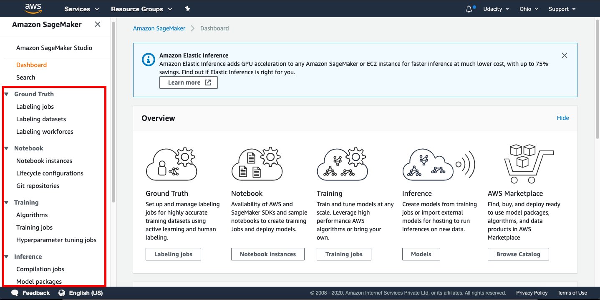
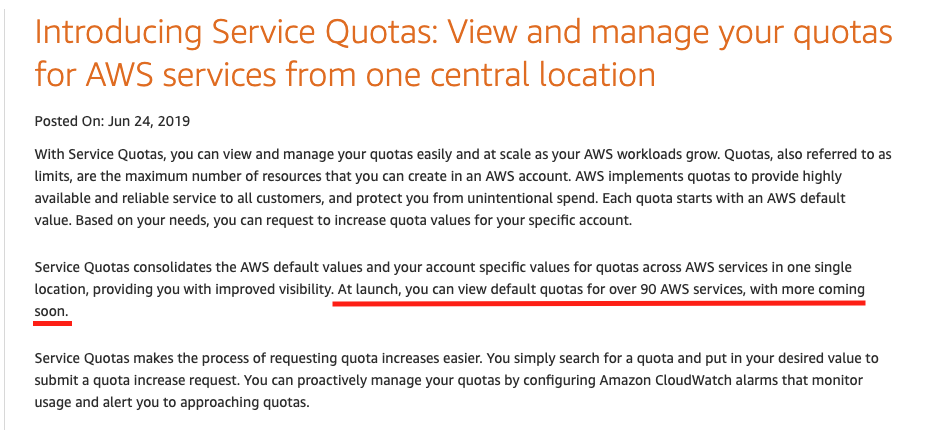
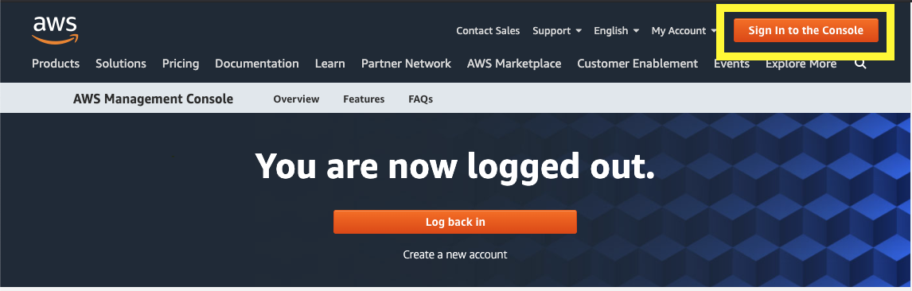
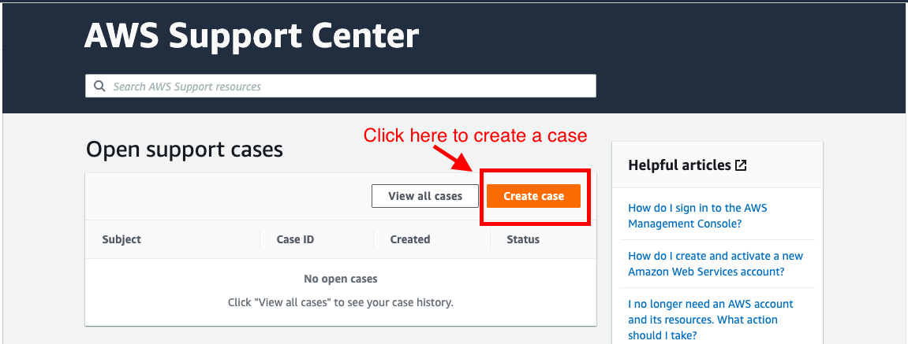
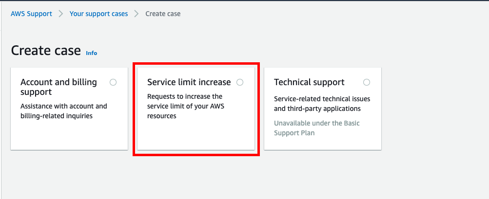
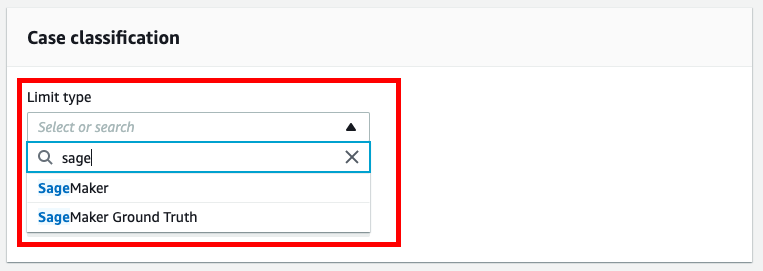

<!-- TOC depthfrom:2 -->

- [How to launch the AWS Console in your Udacity Classroom](#how-to-launch-the-aws-console-in-your-udacity-classroom)
  - [Save your Work](#save-your-work)
  - [Shut Down your Endpoints, if not in use.](#shut-down-your-endpoints-if-not-in-use)
  - [Tracking your Usage](#tracking-your-usage)
- [A. What is AWS Sagemaker?](#a-what-is-aws-sagemaker)
  - [A.1. Why is SageMaker a "fully managed" service?](#a1-why-is-sagemaker-a-fully-managed-service)
  - [A.2. SageMaker Instances - Important to Read](#a2-sagemaker-instances---important-to-read)
  - [A.3. Supported Instance Types and Availability Zones](#a3-supported-instance-types-and-availability-zones)
  - [A.4. Instances Required for Deep Learning](#a4-instances-required-for-deep-learning)
  - [B. Shut Down SageMaker Instances, if not in use](#b-shut-down-sagemaker-instances-if-not-in-use)
  - [Recommended Read](#recommended-read)
- [A. AWS Service Utilization Quota (Limits)](#a-aws-service-utilization-quota-limits)
  - [A.1. Amazon SageMaker Utilization Quota (Limits)](#a1-amazon-sagemaker-utilization-quota-limits)
  - [A.2. Sagemaker Instance Quota (Limit)](#a2-sagemaker-instance-quota-limit)
- [Setting up a Notebook Instance](#setting-up-a-notebook-instance)
- [Searching for SageMaker](#searching-for-sagemaker)
- [Creating and Running a Notebook Instance](#creating-and-running-a-notebook-instance)
- [Getting the Notebooks](#getting-the-notebooks)
- [Cloning the Deployment Notebooks](#cloning-the-deployment-notebooks)
- [Has everything been set up correctly?](#has-everything-been-set-up-correctly)
- [Boston Housing Example](#boston-housing-example)
  - [SageMaker Sessions & Execution Roles](#sagemaker-sessions--execution-roles)
  - [Uploading to an S3 Bucket](#uploading-to-an-s3-bucket)
- [Boston Housing Data](#boston-housing-data)
  - [XGBoost in Competition](#xgboost-in-competition)
  - [Estimators](#estimators)
  - [Training Jobs](#training-jobs)
  - [Transformer](#transformer)
- [Mini-Project](#mini-project)
  - [Building Your First Model](#building-your-first-model)
  - [Solution](#solution)
- [Boston Housing In-Depth](#boston-housing-in-depth)
  - [Data Preparation](#data-preparation)
  - [Creating a Training Job](#creating-a-training-job)
  - [Building a Model](#building-a-model)
  - [Creating a Batch Transform Job](#creating-a-batch-transform-job)
- [Summary](#summary)
  - [What have we learned so far?](#what-have-we-learned-so-far)
  - [What's next?](#whats-next)

<!-- /TOC -->


---

[Video](https://youtu.be/nJCc4_9-iAQ)

Hi, I'm Sean, and together we are going to learn about Amazon's SageMaker service.

To start with, we are going to need to set a few things up.

**Note:** Amazon is constantly iterating and improving the various services that they offer. Sometimes this involves changes to the way certain things look, however, the functionality should be the same. So in the screenshots and videos that follow, if your screen doesn't look exactly the same, don't worry!

---

## How to launch the AWS Console in your Udacity Classroom

To log in to an AWS console, click the **button in the left navigation** labeled **"Launch AWS Console."** This will open the AWS console in a new browser tab. Please note: This may take a few moments to load. You can see brief video below for a walkthrough of the experience.

> *Note that there is a **session time limit**. If reached, you will automatically be timed out. As long as you have not used your entire budget, your work will be saved, and you can re-launch using the same link in the left nav to return to your session.<br><br>If you have a pop-up blocker installed, it may prevent the new tab from launching. Please be sure to allow pop-ups from Udacity.*

[video](https://youtu.be/TD8Wg3-TiQ4)

### Save your Work

All AWS services are a pay-as-you-go service.

**The budget for this entire Nanodegree is `$75`** . We find about `$20` sufficient for most to complete this Nanodegree.

You need to make sure that you have adequate budget available to complete your project/task.
**If you hit your budget, your session will time out and your work will be lost and unrecoverable.**

***Note: For student learning, Udacity has set a budget for the student to complete their course work. Please understand that these credits are limited and available for you to use judiciously.***

### Shut Down your Endpoints, if not in use.

> ***Note:** We recommend you shut down every resource (e.g., EC2 instances, or any other hosted service) on the AWS cloud immediately after the usage, otherwise you will run out of your free promo credits.*

Remember, even if you are in the middle of the project and need to step away, P**LEASE SHUT DOWN YOUR ENDPOINTS**. You can re-instantiate later.

### Tracking your Usage

If you have questions about your usage, please submit a support ticket to Student Services who will be able to provide your current usage.

---

## A. What is AWS Sagemaker?

AWS (or Amazon) SageMaker is a fully managed service that provides the ability to build, train, tune, deploy, and manage large-scale machine learning (ML) models quickly. Sagemaker provides tools to make each of the following steps simpler:

1. Explore and process data
   - Retrieve
   - Clean and explore
   - Prepare and transform
2. Modeling
   - Develop and train the model
   - Validate and evaluate the model
3. Deployment
   - Deploy to production
   - Monitor, and update model & data

The Amazon Sagemaker provides the following tools:

- Ground Truth - To label the jobs, datasets, and workforces
- Notebook - To create Jupyter notebook instances, configure the lifecycle of the notebooks, and attache Git repositories
- Training - To choose an ML algorithm, define the training jobs, and tune the hyperparameter
- Inference - To compile and configure the trained models, and endpoints for deployments

The snapshot of the Sagemaker Dashboard below shows the tools mentioned above.



> *IMPORTANT NOTICE: This is the current AWS UI as of April 6th, 2020. The AWS UI is subject to change on a regular basis. We advise students to refer to AWS documentation for the above process.*

### A.1. Why is SageMaker a "fully managed" service?

SageMaker helps to reduce the complexity of building, training and deploying your ML models by offering all these steps on a single platform. SageMaker supports building the ML models with modularity, which means you can reuse a model that you have already built earlier in other projects.

### A.2. SageMaker Instances - Important to Read

SageMaker instances are the dedicated VMs that are optimized to fit different machine learning (ML) use cases. ``The supported instance types, names, and pricing in SageMaker are different than that of EC2.`` Refer the following links to have better insight:

- [Amazon SageMaker ML Instance Types](https://aws.amazon.com/sagemaker/pricing/instance-types/) - ***See that an instance type is characterized by a combination of CPU, memory, GPU, GPU memory, and networking capacity.***
- [Amazon EC2 Instance Types](https://aws.amazon.com/ec2/instance-types/) - To have you know the difference in naming and combinations of CPU, memory, storage, and networking capacity.

### A.3. Supported Instance Types and Availability Zones

Amazon SageMaker offers a variety of instance types. Interestingly, **the type of SageMaker instances that are supported varies with AWS Regions and Availability Zones.**

- First, you need to check the [List of the AWS Regions that support Amazon SageMaker](https://docs.aws.amazon.com/general/latest/gr/rande.html#sagemaker_region).
- Next, you can check the various available [Amazon SageMaker ML Instance Types](https://aws.amazon.com/sagemaker/pricing/instance-types/), again.

### A.4. Instances Required for Deep Learning

The table below describes the three types of SageMaker instances that you would use in this course:

| SageMaker Instance | vCPU | GPU   | Mem(GiB) | GPU Mem (GiB) | Network Performance | Usage                                                                                       | Default Quota (Limit) |
|--------------------|------|-------|----------|---------------|---------------------|---------------------------------------------------------------------------------------------|-----------------------|
| ml.t2.medium       | 2    | -     | 4        | -             | Low to Moderate     | Run Notebooks                                                                               | 0 - 20                |
| ml.m4.xlarge       | 4    | -     | 16       | -             | High                |Train and batch transform XGBoost models; Deploy all models preceding the first project | 0 - 20                |
| ml.p2.xlarge       | 4    | 1xK80 | 61       | 12            | High                | Train and batch transform GPU accelerated PyTorch models for the first project              | 0 - 1                 |


In this course, the ``ml.m4.xlarge`` is needed at an early stage, while ``ml.p2.xlarge`` is needed only when working on the for the first project: Deploying a Sentiment Analysis Model.

> ***Note** <br> Sagemaker quotas, also referred to as limits, are very tricky. Every AWS user does not get the default quotas for SageMaker instances, which is why the last column shows a range, e.g., 0 - 20. The **Default Quota** depends on the instance type, the task you want to run (see table above), and also the region in which the Sagemaker service is requested. Refer [this document](https://docs.aws.amazon.com/general/latest/gr/sagemaker.html) having a caveat that new accounts may not always get the default limits.*

### B. Shut Down SageMaker Instances, if not in use

> ***Note: We recommend you shut down every resource (e.g., SageMaker instances, or any other hosted service) on the AWS cloud immediately after the usage; otherwise, you will be billed even if the resources are not in actual use.***

Even if you are in the middle of the project and need to step away, **PLEASE SHUT DOWN YOUR SAGEMAKER INSTANCE**. You can re-instantiate later.

### Recommended Read

[AWS Sagemaker FAQs](https://aws.amazon.com/sagemaker/faqs/)

---

## A. AWS Service Utilization Quota (Limits)

You need to understand the way AWS imposes ***utilization quotas*** (limits) on almost all of its services. *Quotas*, also referred to as limits, are the maximum number of resources of a particular service that you can create in your AWS account.

- AWS provides default quotas, **for each AWS service**.
- Importantly, **each quota is region-specific**.
- There are three ways to **view your quotas**, as mentioned here:
    1. Service Endpoints and Quotas,
    2. Service Quotas console,
    3. AWS CLI commands - ``list-service-quotas`` and ``list-aws-default-service-quotas``
- In general, there are three ways to **increase the quotas**:
    1. Using [Amazon Service Quotas](https://aws.amazon.com/about-aws/whats-new/2019/06/introducing-service-quotas-view-and-manage-quotas-for-aws-services-from-one-location/) service - This service consolidates your account-specific values for quotas across all AWS services for improved manageability. Service Quotas is available at no additional charge. You can directly try logging into [Service Quotas console](https://console.aws.amazon.com/servicequotas/home) here.
    2. Using [AWS Support Center](https://console.aws.amazon.com/support/home) - You can create a case for support from AWS.
    3. AWS CLI commands - ``request-service-quota-increase``

### A.1. Amazon SageMaker Utilization Quota (Limits)

You can view the Amazon SageMaker Service Limits at "[Amazon SageMaker Endpoints and Quotas](https://docs.aws.amazon.com/general/latest/gr/sagemaker.html)" page. You can request to increase the AWS Sagemaker quota using the [AWS Support Center](https://console.aws.amazon.com/support/home) only. Note that ``currently the Amazon Service Quotas does not support SageMaker service``. However, SageMaker would be introduced soon into Service Quotas. AWS is moving to make users manage quotas for all AWS services from one central location.


SageMaker would be introduced soon into Services Quota - Courtesy - [Amazon Service Quotas](https://aws.amazon.com/about-aws/whats-new/2019/06/introducing-service-quotas-view-and-manage-quotas-for-aws-services-from-one-location/)

### A.2. Sagemaker Instance Quota (Limit)

Udacity has already set increased quotas for ``ml.m4.xlarge`` and ``ml.p2.xlarge`` so students won't need to worry about these quotas during the duration of their coursework.

1. Sign in to AWS console - https://aws.amazon.com/console/


Sign in to AWS console

2. Go to the [AWS Support Center](https://console.aws.amazon.com/support/home#/) and create a case.


AWS Support Center

3. Click on Service limit increase


Create a case for support

4. It will expand three sections - *Case classification*, *Case description*, and *Contact options* on the same page. In Case *classification* section, select "**Sagemaker**" as the Limit type.

Case classification section that takes the Limit type

5. It will expand one more section - *Requests* on the same page. In Request section, and select the Region in which you are using the SageMaker service.
- Select Sagemaker Training as the Resource Type
- Select the instance type (ml.m4.xlarge or ml.p2.xlarge) under the Limit field
- Under new limit value, select 1


Request section that takes Region, Resource type, and LImit values

6. Provide a case description and the contact options before submitting the case to support.


> *IMPORTANT NOTICE: This is the current AWS UI as of April 6th, 2020. The AWS UI is subject to change on a regular basis. We advise students to refer to AWS documentation for the above process.*

---

## Setting up a Notebook Instance

The first thing we are going to need to do is set up a notebook instance!

This will be the primary way in which we interact with the SageMaker ecosystem. Of course, this is not the *only* way to interact with SageMaker's functionality, but it is the way that we will use in this module.

The video below guides you through setting up your first notebook instance. Also, if you prefer to read the instructions instead, these have been provided underneath the video.

**Note:** Once a notebook instance has been set up, by default, it will be **InService** which means that the notebook instance is running. This is important to know because the cost of a notebook instance is based on the length of time that it has been running. This means that once you are finished using a notebook instance you should **Stop** it so that you are no longer incurring a cost. Don't worry though, you won't lose any data provided you don't delete the instance. Just start the instance back up when you have time and all of your saved data will still be there.

[Video](https://youtu.be/TRUCNy5Eqjc)

## Searching for SageMaker

Your main console page may look slightly different than in the above example. You should still be able to find **Amazon SageMaker** by either:

1. Clicking on All Services then scrolling down and navigating to Machine Learning> Amazon SageMaker, or
2. By searching for SageMaker, as in the below screenshot (and clicking on it).

Finding SageMaker in the search bar.

## Creating and Running a Notebook Instance

First, start by logging in to the [AWS console](https://console.aws.amazon.com/), opening the SageMaker dashboard, selecting **Notebook Instances** and clicking on **Create notebook instance**.

You may choose any name you would like for your notebook. Also, using **ml.t2.medium** should be all that is necessary for the notebooks that you will encounter in this module. In addition, an **ml.t2.medium** instance is covered under the free tier.

Next, under **IAM role** select **Create a new role**. You should get a pop-up window that looks like the one below. The only change that needs to be made is to select **None** under **S3 buckets you specify**, as is shown in the image below.


Once you have finished setting up the role for your notebook, your notebook instance settings should look something like the image below.


**Note:** Your notebook name may be different than the one displayed and the IAM role that appears will be different.

Now scroll down and click on **Create notebook instance**.

Once your notebook instance has started and is accessible, click on **open** to get to the Jupyter notebook main page.

---

## Getting the Notebooks

Recently, SageMaker has added a line in the setup code to link directly to a Github repository and it's recommended that you use that setup!

Also on the ``Actions`` list, you should select ``Open Jupyter`` to get to the examples notebooks. from the dropdown menu, you'll still be able to see the ``Stop`` action.

Now that your notebook instance has been set up and is running, it's time to get the notebooks that we will be using during this module.

These notebooks are stored in a [repository on Github](https://github.com/udacity/sagemaker-deployment) and the easiest way to make them available inside of your notebook instance is to use **git** and clone the repository.

The video below goes through this process. Also, if you would prefer to read the instructions, these have been provided and can be found underneath the video.

[Video](https://youtu.be/jqL74whe9yo)

## Cloning the Deployment Notebooks

In order to clone the deployment repository into your notebook instance, click on the **new** drop down menu and select **terminal**. By default, the working directory of the terminal instance is the home directory, however, the Jupyter notebook hub's root directory is under ``SageMaker``. Enter the appropriate directory and clone the repository as follows:

```bash
cd SageMaker
git clone https://github.com/udacity/sagemaker-deployment.git
exit
```

After you have finished, close the terminal window.

Your notebook instance is now set up and ready to be used!

## Has everything been set up correctly?

As you proceed through the lessons that follow you will get a chance to use Amazon's SageMaker service. However, in order to do so you will need to make sure that everything has been set up.

This is meant to be a checklist that you can use to make sure you've completed all of the preparation steps.

- [ ] Create an AWS Account
- [ ] Apply AWS Credits
- [ ] Checked for GPU Access
- [ ] Submit a Limit Increase Request (if necessary)
- [ ] Create a SageMaker Notebook Instance
- [ ] Clone the Deployment Repository (notebooks) into your Notebook Instance

---

## Boston Housing Example

[Video](https://youtu.be/78y5cTR-JxM)

### SageMaker Sessions & Execution Roles

SageMaker has some unique objects and terminology that will become more familiar over time. There are a few objects that you'll see come up, over and over again:

- **Session** - A session is a special object that allows you to do things like manage data in S3 and create and train any machine learning models; you can read more about the functions that can be called on a session, [at this documentation](https://sagemaker.readthedocs.io/en/latest/session.html). The ``upload_data`` function should be close to the top of the list! You'll also see functions like ``train``, ``tune``, and ``create_model`` all of which we'll go over in more detail, later.
- **Role** - Sometimes called the execution role, this is the IAM role that you created when you created your notebook instance. The role basically defines how data that your notebook uses/creates will be stored. You can even try printing out the role with ``print(role)`` to see the details of this creation.

### Uploading to an S3 Bucket

Another SageMaker detail that is new is the method of data storage. In these instances, we'll be using S3 buckets for data storage.

> *S3 is a virtual storage solution that is mostly meant for data to be written to few times and read from many times. This is, in some sense, the main workhorse for data storage and transfer when using Amazon services. These are similar to file folders that contain data and metadata about that data, such as the data size, date of upload, author, and so on.*

**S3** stands for Simple Storage Service (S3).

After you upload data to a session, you should see that an S3 bucket is created, as indicated by an output like the following:
```
INFO: sagemaker: Created S3 bucket: <message specific to your locale, ex. sagemaker-us-west-1-#>
```
If you'd like to learn more about how we're creating a csv file, you can check out the [pandas documentation](https://pandas.pydata.org/pandas-docs/stable/generated/pandas.concat.html). Above, we are just concatenating x and y data sets as columns of data (``axis=1``) and converting that pandas dataframe into a csv file using ``.to_csv``.

## Boston Housing Data

For our very first time using SageMaker we will be looking at the problem of estimating the median cost of a house in the Boston area using the [Boston Housing Dataset](https://www.cs.toronto.edu/~delve/data/boston/bostonDetail.html).

We will be using this dataset often throughout this module as it provides a great example on which to try out all of SageMaker's features.

In addition, we will be using a random tree model. In particular, we will be using the [XGBoost](https://xgboost.readthedocs.io/en/latest/) algorithm. The details of XGBoost are beyond the scope of this module as we are interested in learning about SageMaker. If you would like to learn more about XGBoost I would recommend starting with the documentation which you can find at https://xgboost.readthedocs.io/en/latest/

The notebook we will be working though in this video and in the following two videos can be found in the ``Tutorial`` directory and is called ``Boston Housing - XGBoost (Batch Transform) - High Level.ipynb``. Now that you know why **Boston Housing** and **XGBoost** are in the name, let's talk a bit about the rest of it.

First, **Batch Transform** is the method we will be using to test our model once we have trained it. This is something that we will discuss a little more later on.

Second, **High Level** describes the API we will be using to get SageMaker to perform various machine learning tasks. In particular, it refers to the Python SDK whose documentation can be found here: https://sagemaker.readthedocs.io/en/latest/. This high level approach simplifies a lot of the details when working with SageMaker and can be very useful.

---
[Video](https://youtu.be/rqYlkCTLmIY)

### XGBoost in Competition

There's a [list of winning XGBoost-based solutions](https://github.com/dmlc/xgboost/tree/master/demo#machine-learning-challenge-winning-solutions) to a variety of competitions, at the linked XGBoost repository.

### Estimators

You can read [the documentation on estimators](https://sagemaker.readthedocs.io/en/latest/estimators.html) for more information about this object. Essentially, the Estimator is an object that specifies some details about how a model will be trained. It gives you the ability to create and deploy a model.

### Training Jobs

A training job is used to train a specific estimator.

When you request a training job to be executed you need to provide a few items:

1. A location on S3 where your training (and possibly validation) data is stored,
2. A location on S3 where the resulting model will be stored (this data is called the model artifacts),
3. A location of a docker container (certainly this is the case if using a built in algorithm) to be used for training
4. A description of the compute instance that should be used.

Once you provide all of this information, SageMaker will executed the necessary instance (CPU or GPU), load up the necessary docker container and execute it, passing in the location of the training data. Then when the container has finished training the model, the model artifacts are packaged up and stored on S3.

You can see a high-level (which we've just walked through) example of training a KMeans estimator, [in this documentation](https://docs.aws.amazon.com/sagemaker/latest/dg/ex1-train-model-create-training-job.html). This high-level example defines a KMeans estimator, and uses ``.fit()`` to train that model. Later, we'll show you a low-level model, in which you have to specify many more details about the training job.

---

[Video](https://youtu.be/CZRKuS_qYtg)

### Transformer

You can read more about the transform and wait functions, in [the transformer documentation](https://sagemaker.readthedocs.io/en/latest/transformer.html). In this case, the transformer is used to create a transform job and **evaluate a trained model**. The ``transform`` function takes in the location of some test data, and some information about how that test data is formatted.

---

## Mini-Project

### Building Your First Model

[Video](https://youtu.be/ouLvRqMMbbY)

Now that you've seen an example of how to use SageMaker, it's *your* turn to try it out!

If you look at the deployment [Github repository](https://github.com/udacity/sagemaker-deployment), inside of the ``Mini-Projects`` folder is a notebook called ``IMDB Sentiment Analysis - XGBoost (Batch Transform).ipynb``. Inside of the notebook are some tasks for you to complete.

As you progress through the notebook you will construct an XGBoost model that tries to determine the sentiment, positive or negative, of a movie review using the [IMDB Dataset](http://ai.stanford.edu/~amaas/data/sentiment/). Moving forward, most of the mini-projects that you will complete throughout this module will use the IMDB dataset.

**Note:** For the most part, creating this XGBoost model is pretty similar to the Boston Housing example that we just looked at so you can look there if you get stuck. In addition, a solution has been provided and in the next video we will go over my solution to this notebook.

---

### Solution
[Video](https://youtu.be/utUxiW-tZrY)

---

## Boston Housing In-Depth

### Data Preparation

[Video](https://youtu.be/TA-Ms7djeL0)

Now that we've had a chance to look at how SageMaker is used, let's take a deeper look at what is going on behind the scenes.

In the previous notebooks we looked at, we use the Python SDK to interact with SageMaker, calling this the high-level approach. Now we will look at the low level approach where we describe different tasks we want SageMaker to perform. The documentation for the low level approach can be found in the [Amazon SageMaker Developer Guide](https://docs.aws.amazon.com/sagemaker/latest/dg/whatis.html)

The notebook that we will be looking at in this video and in the remainder of this lesson is contained in the ``Tutorial`` folder and is the ``Boston Housing - XGBoost (Batch Transform) - Low Level.ipynb notebook``.

You will notice as we go through the details that describing the different tasks we want SageMaker to do can be quite involved. However there is a reason to understand it!

The high level approach makes developing new models very straightforward, requiring very little code. The reason this can be done is that certain decisions have been made for you. The low level approach allows you to be far more particular in how you want the various tasks executed, which is good for when you want to do something a little more complicated.

---

### Creating a Training Job
[Video](https://youtu.be/1CIbWNUSZXo)

---

### Building a Model
[Video](https://youtu.be/JJyVsmcV2M4)

---

### Creating a Batch Transform Job
[Video](https://youtu.be/JwPJMYRl3nw)

---

## Summary

### What have we learned so far?

In this lesson we went over the basics of how models can be constructed and trained using Amazon SageMaker. In addition, we saw some of how SageMaker works and how it interacts with other services.

In particular, we learned how Amazon S3 is used as a central storage service when using SageMaker. In order to train a model, data must first be available on S3, and once the model has been trained, the model artifacts are also stored on S3.

We also saw how to use SageMaker to train models and fit them to data, saving the results (called model artifacts).

Lastly, we looked at how we could use SageMaker's Batch Transform functionality to test our models.

### What's next?

In the next few lessons we are going to look at some of the more advanced functionality of SageMaker.

To begin with, we will look at deploying a model using SageMaker. This means making a model available for other entities to use. Along the way we will create a simple web app that interacts with a deployed model.

In addition, we will look at hyperparameter tuning. Which is a way to train a bunch of different models, all with different hyperparameters, and then select the one that performs the best.

Lastly, we will take a look at updating a deployed model. Sometimes a model may not work as well as it once did due to changes in the underlying data. In [this resource](https://edouardfouche.com/Data-Stream-Generation-with-Concept-Drift/), you can read more about how a model's predictions and accuracy may degrade as a result of something called ``concept drift``, which is a change in the underlying data distribution over time. When this happens we might want to update a deployed model, however, our model may be in use so we don't want to shut it down. SageMaker allows us to solve this problem without there being any loss of service.

